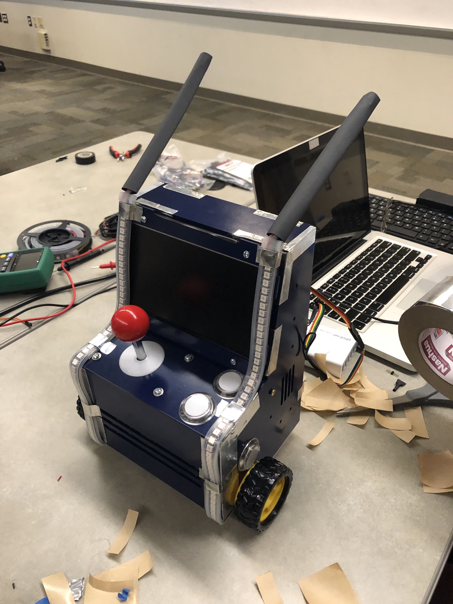
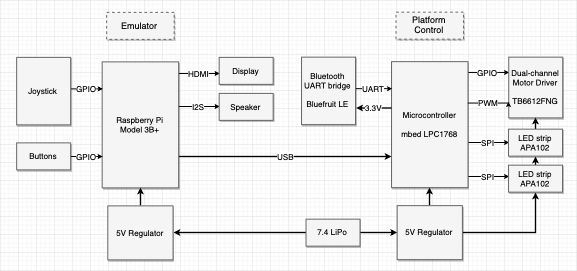
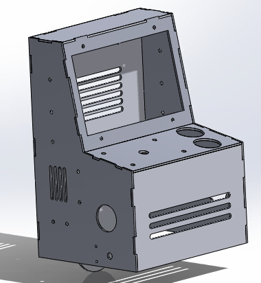
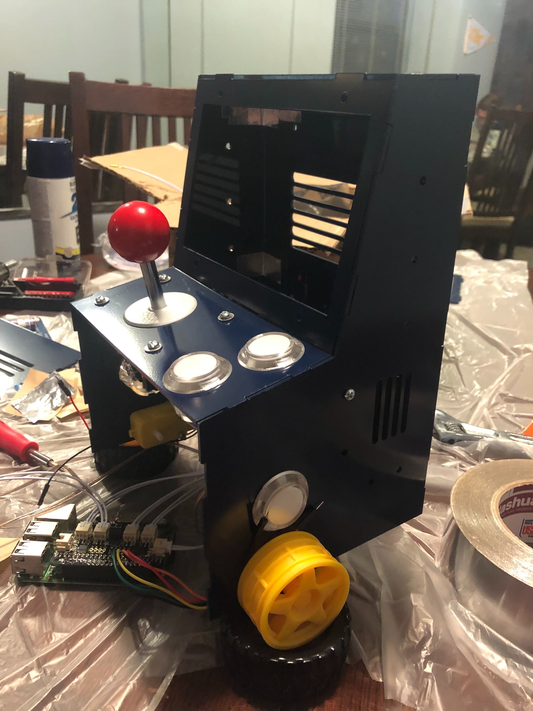
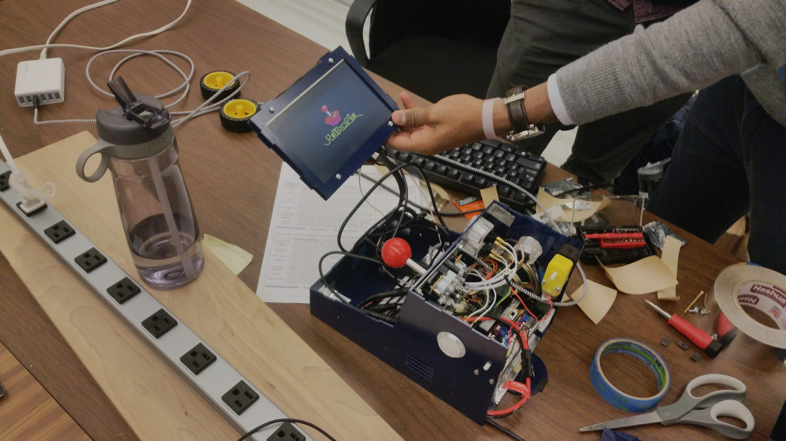
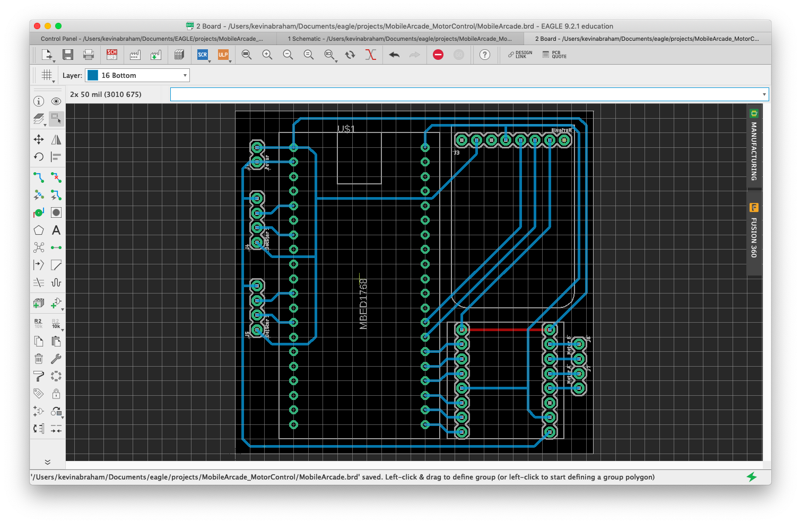
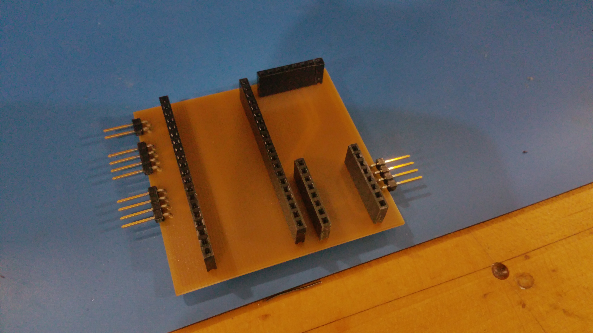
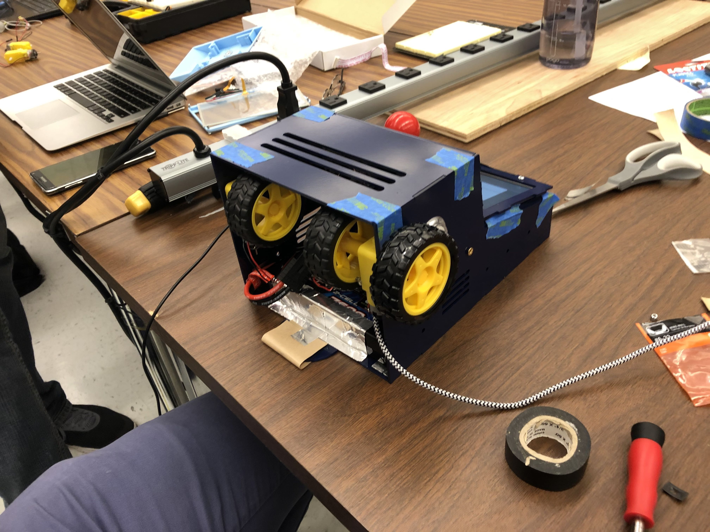
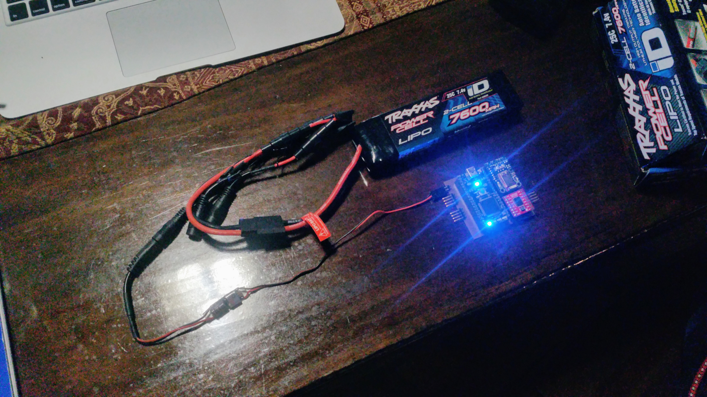

### Table of Contents
* [Concept](#concept)
* [System Design](#system-design)
* [Physical Enclosure](#physical-enclosure)
* [Arcade Emulator](#arcade-emulator)
* [Mbed PCB](#mbed-pcb)
  * [Drive System](#drive-system)
  * [Lighting](#lighting)
  * [Power System](#power-system)
* [Results](#results)

### Concept

> "Develop a mobile arcade cabinet that can be controlled over Bluetooth to enable ultimate portability and usability, while maintaining retro charm."

The Mobile Arcade was designed to incorporate a retro gaming experience with a quirky mobile chassis. The original idea was centered around a table top arcade experience with additional entertainment features, including vibrant and responsive lighting. In order to better suit and entertain the target audience (children aged 9 through 14), mobility was incorporated as well. With this in mind, the following design requirements were set:
1. Fully functional, single player, arcade system (ability to play NES and Atari games)
2. Visually pleasing enclosure with a retro feel
3. Interactive lighting
4. Basic Bluetooth-controlled mobility

### System Design

The design of the mobile arcade was divided into distinct subsystems: the physical enclosure, the arcade emulator, and the low-level drive system and lighting control. Each of these systems are outlined here.

The following block diagram illustrates all components of the arcade system:

* Raspberry Pi: Main processor
  * Handles arcade game emulator and UI
  * Interfaces with joystick and buttons
* Mbed LPC1768: Secondary processor
  * Handles lighting (LED strips)
  * Handles drive system (remotely commanded via the Bluetooth bridge)
* Dual-channel Motor Driver: Controls 2 motors in a tank-drive configuration
* Power: Li-Po battery and 5V regulator supply power to all components

### Physical Enclosure

The enclosure was designed using Dassault Systems’ Solid Works. Each portion of the seven component design was fitted together in software before fabrication was attempted. The structure was created with 3/32in clear acrylic sheets.

The overall shape of the enclosure resembles that of a standard arcade cabinet, however there are a few notable exceptions. The design is much simpler than standard cabinets, reducing the number of distinct components that need to be fabricated for the system to fit together. Additionally, the cabinet incorporates mounting holes specifically designed to accommodate geared drive motors. Two motors can be fixed near the front of the cabinet, while a rounded skid drags at the rear. This produces a "tank drive" configuration which allows the enclosure to maneuver deftly around its environment.

The enclosure after laser cutting and two coats of dark blue spray paint.

Trial fit with the control components in place.

### Arcade Emulator

**TODO** Raspberry Pi stuff

### Mbed PCB

In order to neatly connect the Mbed to the Bluetooth bridge, motor driver, and the LED strips, a single-layer PCB was designed and fabricated. 90º headers were used so that the connections occupied minimal space.

Mbed PCB design

Completed PCB

All code for the Mbed can be found [here](https://os.mbed.com/users/abraha2d/code/MobileArcade/file/).

#### Drive System

The following library was used to control the Dual-channel motor driver. **TODO Kevin** Adapted from simon/Motor, added short braking
[Extended Motor driver library](https://os.mbed.com/users/abraha2d/code/Motor/)

Wheels were added to both sides of the motors to improve stability and ensure traction. Since the rear contact point is a slider, more traction is required for turns. Below is an image with the left two wheels in place.

#### Lighting

[Dotstar LED strips](https://www.adafruit.com/product/2239) were used to implement the interactive lighting features of the Mobile Arcade. These were chosen over NeoPixels due to the standard SPI interface and relaxed timing requirements of the integrated APA102 chip, allowing for relatively easy interface with the Mbed. Since no official library was available for interfacing with the APA102, a simple library was created that fulfilled our needs.

[Custom APA102 Mbed library](https://os.mbed.com/users/abraha2d/code/APA102/)

Code was written to accept input from the Raspberry Pi over USB serial to synchronize lighting effects to certain events in the arcade emulator. For example, on emulation startup, a startup animation is shown on the LEDs. Other effects include a similar shutdown animation, as well as lighting theme changes when games are started/stopped.

#### Power System

The Mobile Arcade is powered using a wiring harness connected to a large lithium-ion battery pack. A 5V 3A regulator, connected the harness, is used to provide power for the Raspberry Pi, Mbed LPC1768, motors, and LED strips. The LCD is able to plug directly into the harness without further regulation. Fuses are integrated into the harness to protect sensitive components.

Wiring harness setup

### Results

[Demo](https://youtu.be/UGc3tqysLSs)
