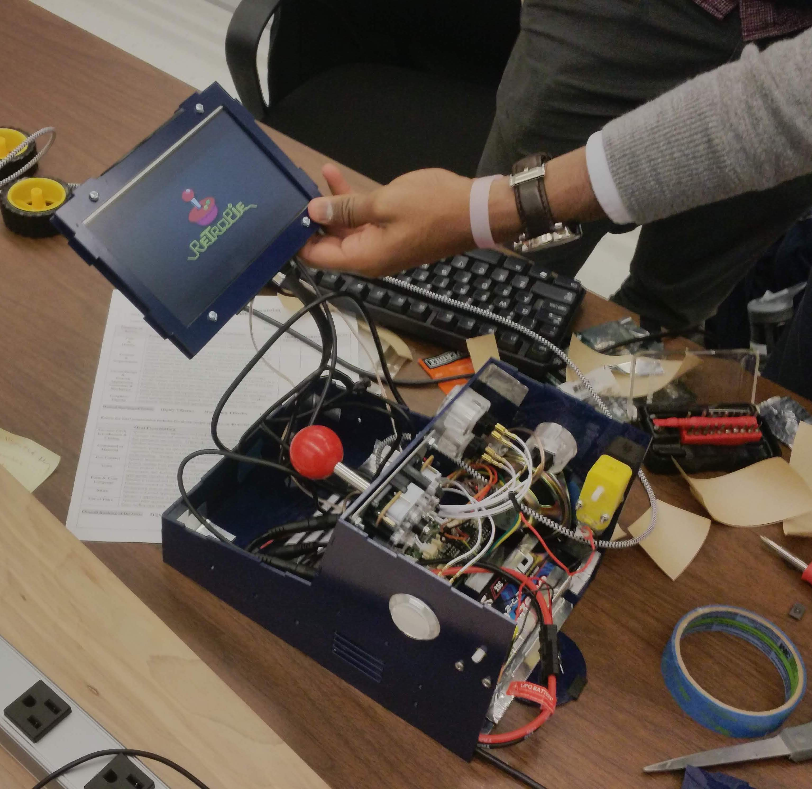

{:height="480px"}

### Table of Contents
* [Concept](#concept)
* [System Design](#system-design)
  * [Physical Enclosure](#physical-enclosure)
  * [Arcade Emulator](#arcade-emulator)
  * [Low-level Control](#low-level-control)
    * [Drive System](#drive-system)
    * [Lighting](#lighting)
  * [Power](#power)
* [Instructions](#instructions)
* [Results](#results)

## Concept

> "Develop a mobile arcade cabinet that can be controlled over Bluetooth to enable ultimate portability and usability, while maintaining retro charm."

The Mobile Arcade was designed to incorporate a retro gaming experience with a quirky mobile chassis. The original idea was centered around a table top arcade experience with additional entertainment features, including vibrant and responsive lighting. In order to better suit and entertain the target audience (children aged 9 through 14), mobility was incorporated as well. With this in mind, the following design requirements were set:
1. Fully functional, single player, arcade system (ability to play NES and Atari games)
2. Visually pleasing enclosure with a retro feel
3. Interactive lighting
4. Basic Bluetooth-controlled mobility

## System Design

The design of the mobile arcade was divided into distinct subsystems: the physical enclosure, the arcade emulator, and the low-level drive system and lighting control. Each of these systems are outlined here.

* Raspberry Pi: Main processor
  * Handles arcade game emulator and UI
  * Interfaces with joystick and buttons
* Mbed LPC1768: Secondary processor
  * Handles lighting (LED strips)
  * Handles drive system (remotely commanded via the Bluetooth bridge)
* Dual-channel Motor Driver: Controls 2 motors in a tank-drive configuration
* Power: Li-Po battery and 5V regulator supply power to all components

### Physical Enclosure

The enclosure was designed using Dassault Systems’ Solid Works. Each portion of the seven component design was fitted together in software to ensure accurate dimensioning. The enclosure was then fabricated using 3/32" clear acrylic sheets, laser-cut at the Invention Studio.

The overall shape of the enclosure resembles that of a standard arcade cabinet, with a few notable exceptions. The design is much simpler than standard cabinets, reducing the number of distinct components that need to be fabricated. Additionally, the cabinet incorporates mounting holes near the front specifically designed to accommodate geared drive motors. Along with the rear-mounted skid, this produces a "tank drive" configuration which allows the enclosure to maneuver deftly around its environment.

{:width="640px"}

{:height="355px"}
{:height="355px"}

Holes to fit the arcade controls (joystick and buttons) and LCD screen were included. Details about each of these is covered in the next section.

### Arcade Emulator

The emulation portion of the mobile arcade was split into two portions: the physical controls and the emulation software. The raspberry pi acts as the emulation computer for this project. A small LCD screen is used and is mounted above the joystick. This LCD uses hdmi to connect to the pi.

#### _Arcade Controls_

For controlling the arcade, a standard arcade joystick configuration with four additional buttons was chosen. The following parts were acquired from Adafruit to accomplish this:

* [Joystick](https://www.adafruit.com/product/480)
* [Button](https://www.adafruit.com/product/471)
* [Control Bonnet](https://www.adafruit.com/product/3422)
* [Connection Wires](https://www.adafruit.com/product/1949)
* [Speaker](https://www.adafruit.com/product/1314)

The joystick and buttons each have a specific location they fit within the enclosure, and were chosen before the CAD model was finalized. The control bonnet connects directly to the GPIO header on the raspberry pi and allows each of the other elements to easily interface with the emulation software. 

Once each physical element is installed, [this guide](https://learn.adafruit.com/adafruit-arcade-bonnet-for-raspberry-pi) outlines the process of formally installing the Control Bonnet on the pi. In order for it to function correctly, specific software needs to be installed on the pi. This should be done after the emulation software is installed, as outlined below.

#### _Emulation Software_

The common emulation software [RetroPie](https://retropie.org.uk/) was chosen for this project. It works seamlessly with the raspberry pi, the primary processor on the mobile arcade, and it offers decent functionality. Installation is made fairly easy by the fact that the Retropie foundation provides a disk image for the raspberry pi. The steps that were followed for installing the software are as follows:

1. Download the Retropie disk image from their website
2. Burn the image to the raspberry pi's SD card
3. Boot the system and connect it to the ethernet using wifi or ethernet
4. Install the Control Bonnet software (Refer to previous section)
5. Follow the automatic key-bindings dialog
6. Copy ROM files to the appropriate location

Further details about this process (excluding the Control Bonnet) can be found on the [RetroPie](https://retropie.org.uk/) website.

### Low-level Control

The Mbed microcontroller was used to realize low-level lighting and drive system control. In order to neatly connect the Mbed to the Bluetooth bridge, motor driver, and the LED strips, a single-layer PCB was designed in Eagle and fabricated at the Mechanical Engineering electronics lab. 90º headers were used so that the connections occupied minimal vertical space.

The Eagle files for the PCB can be found [here](https://github.com/1961C/Mobile-Arcade/tree/master/eagle).

Mbed code can be found [here](https://os.mbed.com/users/abraha2d/code/MobileArcade/).

{:width="640px"}

#### Drive System

The drive system consists of two motors in a tank-drive configuration, with a rear skid for stability. Wheels were added to both sides of the motors (2 visible outside, 2 hidden inside). Not only does this improve stability and ensure traction, it also adds a level of redundancy to the drive system.

A custom Mbed library was used to control the motor driver. The basic library (located [here](https://os.mbed.com/users/simon/code/Motor/)) was extended to add a short brake feature. The extended motor driver library can be found [here](https://os.mbed.com/users/abraha2d/code/Motor/).

{:width="640px"}

#### Lighting

[Dotstar LED strips](https://www.adafruit.com/product/2239) were used to implement the interactive lighting features of the Mobile Arcade. These were chosen over NeoPixels due to the standard SPI interface and relaxed timing requirements of the integrated APA102 chip, allowing for relatively easy interface with the Mbed. Since no official library was available for interfacing with the APA102, a simple library was created that fulfilled our needs (available [here](https://os.mbed.com/users/abraha2d/code/APA102/)).

The Mbed controls the LED strips in a way that simulates the actions of a real-world vehicle. Simulated lighting effects include headlights, foglights, blinkers, tail/brake lights, reverse lights, and underglow. These lighting effects are controlled in an appropriate way in relation to the movement of the enclosure.

The Mbed also accepts input from the Raspberry Pi over USB serial to synchronize lighting effects to certain events in the arcade emulator. For example, on emulation startup, a startup animation is shown on the LEDs. Other effects include a similar shutdown animation, as well as lighting theme changes when games are started/stopped.

### Power

The Mobile Arcade is powered using a wiring harness connected to a large lithium-ion battery pack. A 5V 3A regulator, connected the harness, is used to provide power for the Raspberry Pi, Mbed LPC1768, motors, and LED strips. The LCD is able to plug directly into the harness without further regulation. Fuses are integrated into the harness to protect sensitive components.

## Instructions

### Hardware setup

* Wiring harness
  * Battery power flows into a two way splitter
    * LCD Screen is powered off of one
    * 5V Regulator connects to the other
  * The 5V Regulator poweres the following items
    * Raspberry pi using a modified Micro USB Cable
    * MBed by powering its custom PCB Directly
    * Motors and LED scrips through the PCB
* Mbed PCB wiring
  * Connect 5V regulator output to power input
  * Connect DotStar LED strips to LED strip outputs
  * Connect motor leads to motor outputs
  * Insert Mbed, Bluetooth bridge, and motor driver in appropriate slots
  * Connect Mbed to Raspberry Pi with a USB cable
* Raspberry Pi Arcade Bonnet wiring ([Guide](https://learn.adafruit.com/adafruit-arcade-bonnet-for-raspberry-pi/connections))
  * Attach each button to one of the wire harness JST connector leads
  * Connect all buttons and the joystick to the Adafruit control bonnet
  * Using speaker wire, attach the speaker to the speaker header on the control bonnet

### Mbed setup

* Upload Mbed code (located [here](https://os.mbed.com/users/abraha2d/code/MobileArcade/))

### Raspberry Pi setup

* Follow RetroPie setup (located [here](retropie.org.uk))
  * Install Adafrit bonnet support software (located [here](https://learn.adafruit.com/adafruit-arcade-bonnet-for-raspberry-pi/software))
* Add runcommand scripts
  * Details about the runcommand scripts can be found [here](https://github.com/RetroPie/RetroPie-Setup/wiki/runcommand#runcommand-onstart-and-runcommand-onend-scripts)
  * Copy the files from '/runcommnads' in this repository to '/opt/retropie/configs/all/' on the raspberry pi
  * Plug the MBED into the pi using USB and ensure that the port (/dev/ttyXXXX) is correct in both runcommand files

## Results

[Demo](https://youtu.be/UGc3tqysLSs)
